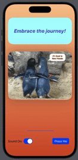

# YouAreAwesome

YouAreAwesome is a SwiftUI application that provides users with motivational quotes and images. Each time the user presses the button, a new quote and image are displayed. The app also includes sound effects that can be toggled on and off.

## Features

- **Motivational Quotes**: Displays a random motivational quote.
- **Inspirational Images**: Displays a random image to complement the quote.
- **Sound Effects**: Plays a random sound effect when the button is pressed, which can be toggled on or off.
- **Animated Transitions**: Smooth animations for quote and image transitions.

## Screenshots



## Requirements

- iOS 15.0+
- Xcode 13.0+
- SwiftUI

## Installation

1. Clone the repository:
```bash
git clone https://github.com/dobson980/YouAreAwesome.git
```

2. Open the project in Xcode:
 ```swift
cd YouAreAwesome
open YouAreAwesome.xcodeproj
```

## Usage

### Main View
The ContentView is the main view of the app where users can press a button to see a new motivational quote and image, with optional sound effects.

## Code Overview

### YouAreAwesomeApp
YouAreAwesomeApp is the entry point of the app.
```swift
import SwiftUI

@main
struct YouAreAwesomeApp: App {
    var body: some Scene {
        WindowGroup {
            ContentView()
        }
    }
}
```
### ContentView
ContentView sets up the main view with motivational quotes, images, and sound effects. Users can press a button to get a new quote and image, with smooth animations and optional sound effects.
```swift
import SwiftUI
import AVFAudio

struct ContentView: View {
    let quotes = [
        "You are awesome!",
        "You are great!",
        "You are amazing!",
        "You are incredible!",
        "You are Outstanding!",
        "Believe in yourself!",
        "You can achieve anything!",
        "Stay positive and strong!",
        "Your potential is limitless!",
        "Keep pushing forward!",
        "Success is within reach!",
        "Embrace the journey!",
        "You are capable of greatness!",
        "Never give up!",
        "You make a difference!",
        "Dream big and dare to fail!",
        "Your efforts matter!",
        "Stay focused and determined!",
        "You are a star!",
        "Shine bright and inspire!"
    ]
    
    @State private var quoteNumber: Int
    @State private var imageNumber: Int
    @State private var soundNumber: Int
    @State private var soundIsOn = true
    @State private var audioPlayer: AVAudioPlayer!
    
    init() {
        _quoteNumber = State(initialValue: Int.random(in: 0..<quotes.count))
        _imageNumber = State(initialValue: Int.random(in: 0...9))
        _soundNumber = State(initialValue: Int.random(in: 0...5))
    }
    
    var body: some View {
        
        GeometryReader { geometry in
            ZStack {
                Rectangle()
                    .fill(
                        Gradient(colors: [Color("Tan"), Color("Vermillion")])
                    )
                    .edgesIgnoringSafeArea(.all)
                
                VStack {
                    Text(quotes[quoteNumber])
                        .font(.title)
                        .padding(1)
                        .fontWeight(.heavy)
                        .foregroundColor(.indigo)
                        .italic()
                        .minimumScaleFactor(0.5)
                        .multilineTextAlignment(.center)
                        .frame(height: 150)
                        .frame(maxWidth: .infinity)
                        .background(Color("SkyBlue"))
                        .cornerRadius(30)
                        .padding()
                        .animation(.easeInOut(duration: 0.15), value: imageNumber)
                    
                    Image("image\(imageNumber)")
                        .resizable()
                        .scaledToFit()
                        .cornerRadius(30)
                        .shadow(radius: 30)
                        .padding()
                        .animation(.easeInOut(duration: 0.7), value: imageNumber)
                    
                    Spacer()
                    
                    Rectangle()
                        .fill(.indigo)
                        .frame(width: geometry.size.width * (2/5), height: 2)
                        .cornerRadius(30)
                    
                    HStack {
                        Text("Sound On:")
                        Toggle("", isOn: $soundIsOn)
                            .labelsHidden()
                            .onChange(of: soundIsOn) {
                                (audioPlayer != nil && audioPlayer.isPlaying) ? audioPlayer.stop() : nil
                            }
                        
                        Spacer()
                        
                        Button("Press Me") {
                            quoteNumber = generateNewRandomNumber(
                                lowerBounds: 0,
                                UpperBounds: quotes.count-1,
                                currentNumber: quoteNumber
                            )
                            
                            imageNumber = generateNewRandomNumber(
                                lowerBounds: 0,
                                UpperBounds: 9,
                                currentNumber: imageNumber
                            )
                            
                            let soundNumber = generateNewRandomNumber(
                                lowerBounds: 0,
                                UpperBounds: 5,
                                currentNumber: soundNumber
                            )
                            soundIsOn ? playSound(sound: "sound\(soundNumber)") : nil
                        }
                        .padding()
                        .buttonStyle(.borderedProminent)
                    }
                    .padding()
                    .tint(.accentColor)
                }
            }
        }
    }
    
    func generateNewRandomNumber(lowerBounds: Int, UpperBounds: Int, currentNumber: Int) -> Int {
        var newNumber: Int
        repeat {
            newNumber = Int.random(in: lowerBounds...UpperBounds)
        } while newNumber ==  currentNumber
        return newNumber
    }
    
    func playSound(sound: String) {
        guard let soundFile = NSDataAsset(name: sound) else {
            print("Could not read file named: \(sound)")
            return
        }
        do {
            audioPlayer = try AVAudioPlayer(data: soundFile.data)
            audioPlayer.play()
        } catch {
            print("Error: \(error.localizedDescription)")
        }
    }
}

#Preview {
    ContentView()
}
```

## License

This project is licensed under the MIT License. See the [LICENSE](LICENSE) file for details.
